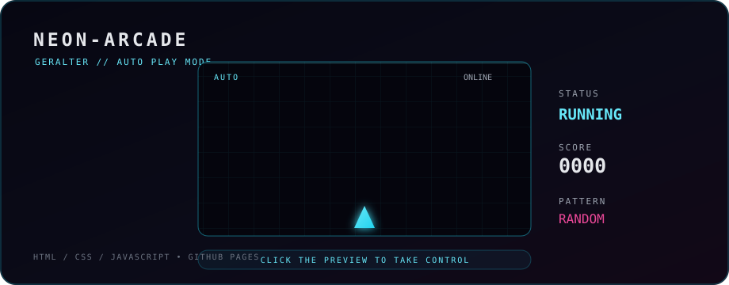

### `DEVELOPER` • `STUDENT` • `TECH ENTHUSIAST`

<em>Building things, learning new technologies and exploring the digital world.</em>

 

---

## `▸ ABOUT ME`

|  |  |
|:---:|:---|
| 🎓 | **Applied Informatics** |
| 💻 | Programming & software development |
| ⚙️ | Minecraft modding & game technologies |
| 🧠 | Learning and improving development skills |
| 🌐 | Exploring new technologies & interesting projects |

---

## `▸ TECH STACK`

### `// CURRENTLY LEARNING`

### `// STUDIED`

### `// COMING SOON`

---

## `▸ NEON-ARCADE`

`AUTO PLAYING` • `RANDOM PATTERNS` • `NEON ENERGY`

> **NEON-ARCADE** is an experimental neon browser game. The preview above is a lightweight animated widget — open it to launch the real interactive game.

---

## `▸ GITHUB // STATS`

  

---

## `▸ PROJECTS`

| PROJECT | DESCRIPTION |
|:---:|:---|
| 🕹️ **[NEON-ARCADE](https://github.com/Gera1ter/Neon-Arcade)** | Experimental neon browser game |
| 📦 **[ABC](https://github.com/Gera1ter/Gera1ter/tree/main/ABC)** | Small university projects and experiments |

---

`DIGITAL WORLD` • `BUILD` • `LEARN` • `EXPLORE`

  

### `KEEP BUILDING. KEEP EXPLORING.`

<!--
**Gera1ter/Gera1ter** is a ✨ _special_ ✨ repository because its `README.md` (this file) appears on your GitHub profile.

Here are some ideas to get you started:

- 🔭 I’m currently working on ...
- 🌱 I’m currently learning ...
- 👯 I’m looking to collaborate on ...
- 🤔 I’m looking for help with ...
- 💬 Ask me about ...
- 📫 How to reach me: ...
- 😄 Pronouns: ...
- ⚡ Fun fact: ...
-->
